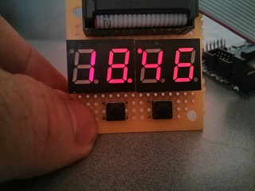
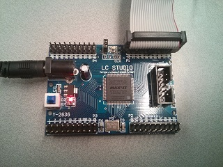

This is my first experiment with VHDL. I created a simple chronometer with seven segments displays showing minutes and seconds. The FPGA is an Altera MAX II. The clock is derived by the 50MHz oscillator present on the board.

The VHDL models simple blocks such as a BCD to seven segment decoder, some three-state buffers, counters and a two to four line decoder, so it mimics pretty much how you would have built such a device
with common logic chips. The displays are multiplexed to both save wiring work but especially cause driving them all on concurrently would have taken too much current from the FPGA, in fact the current 
solution is good only for a prototype as the displays are rather dim and you can actually see that digits with less segments are brighter than others (so the common pin is overloaded).

Below is a picture of the display in action:

And this is the Altera Max II board I used:

